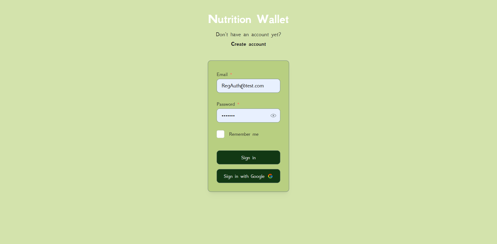
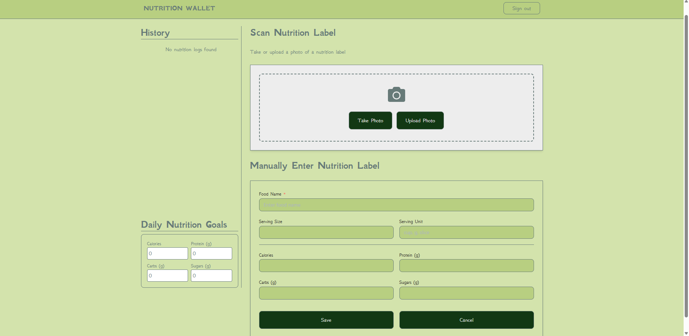
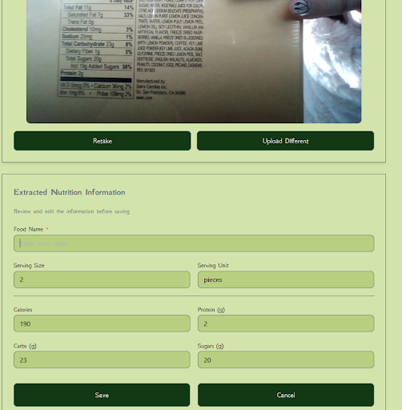
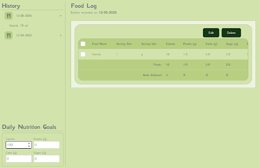

# Nutrition Wallet

This repository contains a Next.js frontend and a FastAPI backend. The instructions below show how to set up both projects locally on Windows PowerShell. 

Prerequisites
- Node.js and your package manager of choice (npm comes with Node)
- Python 3.10+ 
- Git

Frontend (Next.js)

Windows Powershell:

1. Open a PowerShell terminal and go to the frontend folder:
```
   cd frontend
```
2. Copy .env.local file from discord and paste (rename to .env.local if downloads as env.local)


3. Install dependencies:
```
   npm install
```
4. Run the dev server:
```
   npm run dev
```
Backend (FastAPI)

Windows PowerShell:

1. Open a PowerShell terminal and go to the backend folder:
```
   cd backend
```
2. Copy .env file from discord and paste (rename to .env if downloads as env)

3. Create a virtual environment and activate it:
```
   python -m venv .venv 
   .venv\Scripts\Activate.ps1
```
4. Install dependencies:
```
   pip install -r requirements.txt
```
5. Run the development server:
```
   uvicorn app.main:app --reload --port 8000
```

## Usage
Below is a description of the website's functionality.

### Sign In Page


### Home Page 


### OCR Functionality


The `Take Photo` option makes use of Azure's OCR service to extract the relevant information and fill the corresponding fields. 
The user can then fill in missing information or edit the extracted data. This data can be saved and viewed.

### Food Log


The `Food Log` section will automatically populate a table with the foods the user logged on that date, as well as all the nutritional information entered.
On their food log, the user can set their 'Nutrition Goals' at the bottom of the sidebar.